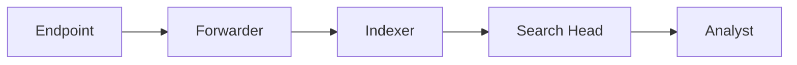

# Security Information and Event Management (SIEM)

- Log Management
- Real-time Monitoring
- Alerting and Notification
- Incident Response
- Dashboard, Reports and Visualization
- Threat Intelligence Integration

## SIEM Log Management

### Collection

- Which devices will we collect events from?
- Which events do we want to collect?
- How long will we retain the logs?
- Where will we store the logs?
- Method of collection
    - Agents
    - Agentless

### Aggregation

- Collecting and consolidating events
- Unifying the timeline across the organization
- Enhancing holistic visibility
- Allows for correlation and analysis

### Parsing and Normalization

- Ensure consistency across logs
- Extracting structures information
    - Fields, Columns
    - Regular Expressions, parsing tools, or custom parsers
- Convert into a common schema
    - Field Mapping
    - Data Transformation
- Retention
    - Storing log data to ensure analysis availability
        - Incident Response
        - Compliance
    - Log Retention Policies
        - Retention Period
        - Storage Solutions
        - Security Controls
        - Storage Integrity

### Indexing

- Turns raw logs into searchable event data
- Repository or grouping of events
- Efficient log retrieval
- Helps with scaling as log sources grow

### Correlation and Analysis

- Linking related log events together
- Contextualization
    - Enriching events with additional meta data
- Correlation Rules
    - Specify how events should be correlated
- Correlation Engines
- Analysis
    - Pattern Recognition
    - Anomaly Detection

### Alerting

- Notify relevant people about security incidents
- Threshold-Based Alerts
- Pattern-Based Alerts
- Anomaly-Based Alerts
- Event-Based Alerts

## SIEM Components

## SIEM Deployment Models

- Single Instance Deployment
- Distributed Deployment
- Clustered Deployment
