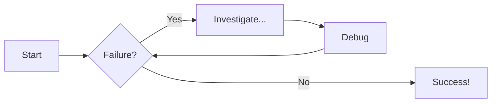
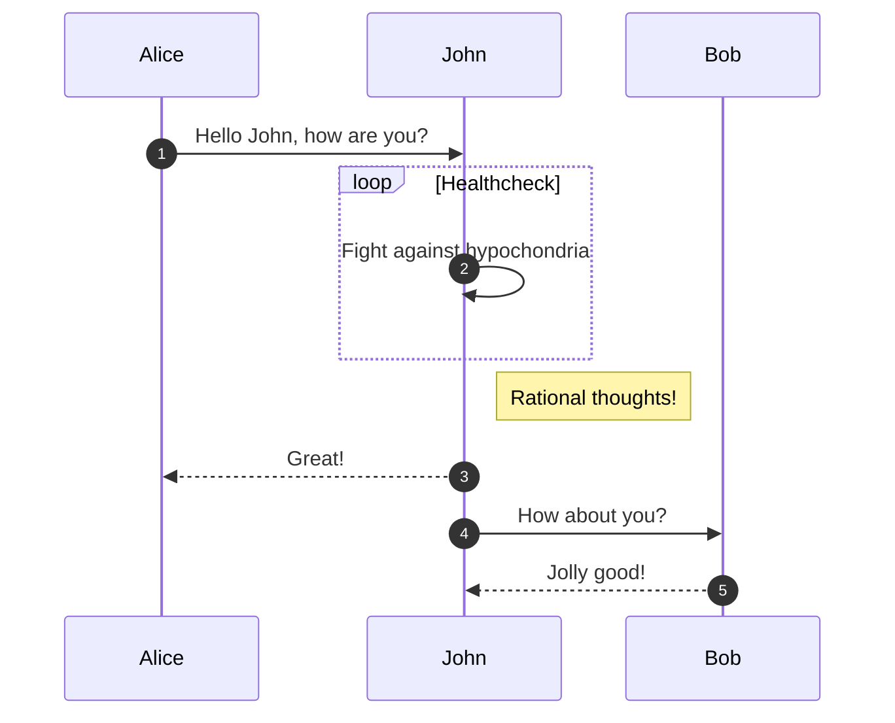

# Welcome to MkDocs

For full documentation visit [mkdocs.org](https://www.mkdocs.org).

## Commands

* `mkdocs new [dir-name]` - Create a new project.
* `mkdocs serve` - Start the live-reloading docs server.
* `mkdocs build` - Build the documentation site.
* `mkdocs -h` - Print help message and exit.

## Project layout

    mkdocs.yml    # The configuration file.
    docs/
        index.md  # The documentation homepage.
        ...       # Other markdown pages, images and other files.

```py title="add_numbers.py" linenums="1" hl_lines="6"
# Function to add two numbers
def add_two_numbers(num1, num2):
    return num1 + num2

# Example usage
result = add_two_numbers(5, 3)
print('The sum is:', result) 
```

### Generic Content

=== "Tab"

    This is some plain text

=== "Unordered Tab"

    * First List
    * Second List
    * Third List

=== "Ordered Tab"

    1. First List
    2. Second List
    3. Third List

!!! note "Title of the callout"

    Lorem ipsum dolor sit amet, consectetur adipiscing elit. Nulla nunc neque, hendrerit et tristique vitae, consectetur id elit. Proin vel massa volutpat, convallis diam vel, accumsan sapien. Curabitur sit amet augue quis eros posuere accumsan lacinia eu nisl. In at hendrerit dui, eget vestibulum ex. Integer pretium est lectus, id elementum turpis mattis ullamcorper. Phasellus elit nisl, pretium sit amet rutrum vel, facilisis vitae sapien. Vivamus ut felis vel urna rutrum ultricies. Nulla laoreet erat ut mauris tincidunt convallis. Nulla vehicula finibus blandit.

??? info "collapsible callout"

    Lorem ipsum dolor sit amet, consectetur adipiscing elit. Nulla nunc neque, hendrerit et tristique vitae, consectetur id elit. Proin vel massa volutpat, convallis diam vel, accumsan sapien. Curabitur sit amet augue quis eros posuere accumsan lacinia eu nisl. In at hendrerit dui, eget vestibulum ex. Integer pretium est lectus, id elementum turpis mattis ullamcorper. Phasellus elit nisl, pretium sit amet rutrum vel, facilisis vitae sapien. Vivamus ut felis vel urna rutrum ultricies. Nulla laoreet erat ut mauris tincidunt convallis. Nulla vehicula finibus blandit.

## Flowcharts



## Sequence Diagram


